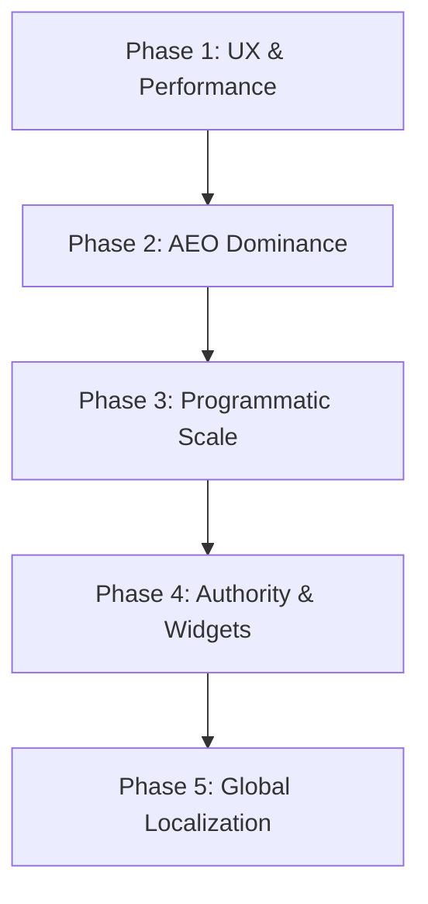

# HelloTools: The Strategic Roadmap to Rank #1

This document outlines the step-by-step master plan to scale **HelloTools** into the world's leading online calculator and utility site, outperforming established competitors like `calculator.net` and `omnicalculator.com`.

---

## 🚀 The Core Philosophy
Competitors have a 15-year head start in Domain Authority (backlinks). To win, we do not copy them; we leapfrog them by delivering:
1.  **Stunning UI/UX:** Clean, dark-mode, ad-light layouts vs. their cluttered, 2005-era designs.
2.  **Unmatched Speed & Privacy:** 100% browser-run tools with zero server-latency and zero user tracking.
3.  **AI Engine Optimization (AEO):** Positioning our site as the primary source for ChatGPT, Claude, and Perplexity Search.

---

## 📅 The 5-Phase Execution Plan

### 1. Phase 1: UX, Performance, and Core Web Vitals (Weeks 1–4)
Google officially prioritizes pages with fast load times and clean layout stability.

*   [ ] **Maintain 100/100 PageSpeed Scores:** Optimize Next.js images, lazy-load heavy components, and minimize unused JS.
*   [ ] **Keep Ads Unobtrusive:** Place AdSense/banners in clean layout wrappers. Never use layout-shifting popup ads or auto-redirects that ruin the mobile score.
*   [ ] **Data Privacy Callouts:** Add a micro-copy badge on every tool page: *"🔒 100% Secure: Calculations run locally inside your browser. Your data is never saved or sent to a server."* (Builds user trust and increases direct bookmarks).

---

### 2. Phase 2: AEO Dominance (Weeks 5–8)
Traditional search displays links. AI engines display synthesized answers. We must structure HelloTools to be read easily by LLM crawlers.

*   [ ] **Structured Data Verification:** Validate that every page dynamically injects `WebApplication`, `FAQPage`, and `BreadcrumbList` JSON-LD schemas.
*   [ ] **Maximize Direct Answers:** Refine our **Quick Answer** sections to be exactly 1–2 sentences. AI search models pull directly from these text snippets.
*   [ ] **Maintain LLMs.txt:** Periodically run `npm run build` or the llms.txt script to ensure all newly added tools are exposed to LLM crawlers.

---

### 3. Phase 3: Content Scale & Programmatic SEO (Weeks 9–16)
To match the keywords indexed by `calculator.net` (millions of keywords), we need to expand our tool directory.

*   [ ] **Expand from 50 to 150+ Tools:** Identify high-volume, low-competition calculator keywords (e.g., *"unpaid salary calculator"* or *"daily hydration calculator by body weight"* instead of just *"salary calculator"*).
*   [ ] **Category Hub Pages:** Optimize index category listings (e.g., `/tools#finance`) so they act as standalone SEO landing pages.
*   [ ] **Batched Updates:** Launch 10 new calculators at a time to prevent indexing volatility.

---

### 4. Phase 4: Embeddable Widgets & Backlink Acquisition (Weeks 17–24)
Older sites have millions of authority backlinks. We can acquire backlinks for free by turning our tools into widgets.

*   [ ] **"Embed this Tool" Snippets:** Add an option under popular calculators (e.g., EMI, Mortgage, BMI) that gives users a copy-pasteable `<iframe>` code snippet.
*   [ ] **Why it works:** Financial advisors, health bloggers, and real estate agents will embed our beautiful calculators on their sites, automatically linking back to `hellotools.net` and boosting our Google Authority.
*   [ ] **Target Outreach:** Share niche tool links directly on platforms like Reddit, Quora, and Product Hunt where users ask questions that our tools solve.

---

### 5. Phase 5: Global Localization (Weeks 25+)
More than 60% of search volume for utility tools is in languages other than English, where competition is far lower.

*   [ ] **Multi-language Support:** Implement Next.js internalization (`i18n`) for key target markets:
    *   Spanish (LATAM / Spain)
    *   Portuguese (Brazil)
    *   French
    *   German
*   [ ] **Localized Slugs:** Route translated tools cleanly, e.g., `/es/tools/calculadora-de-emi`.

---

## 📈 Monthly KPI Tracker
Measure progress on the 1st of every month:

| Metric | Goal (6 Months) | Goal (1 Year) | Where to Check |
| :--- | :--- | :--- | :--- |
| **Organic Impressions** | 500k / mo | 5M+ / mo | Google Search Console |
| **Average Position** | < 15 | < 5 | Google Search Console |
| **Referencing Domains** | 100+ | 1,000+ | Ahrefs / Moz / Semrush |
| **AI Citation Shares** | 100+ | 1,000+ | Perplexity / ChatGPT Search |
| **Direct Bookmark Traffic** | 15% | 30%+ | Google Analytics |
